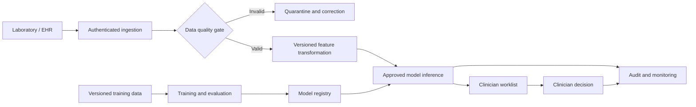

# ML System Design Summary

## Problem statement

Thiết kế một dịch vụ hỗ trợ quyết định có khả năng:

1. Kiểm tra chất lượng dữ liệu đo tế bào.
2. Tạo malignancy risk score và priority band cho mỗi ca hợp lệ.
3. Đưa ca có rủi ro cao lên trước trong danh sách xét duyệt.
4. Lưu đầy đủ model version, threshold version và hành động của bác sĩ.
5. Chuyển sang quy trình manual-only khi dữ liệu hoặc hạ tầng không an toàn.

## High-level architecture

## Primary design goals

| Level | Goal | Example metric |
|---|---|---|
| Business | Rút ngắn thời gian xét duyệt ca rủi ro cao | Median time to first review giảm ít nhất 30% |
| System | Phản hồi nhanh và có fallback an toàn | p95 latency dưới 2 giây, availability tối thiểu 99.5% |
| Model | Hạn chế bỏ sót ca malignant | Malignant recall tối thiểu 0.95 trên locked test set |
| Governance | Mọi quyết định đều truy vết được | 100% prediction có model và threshold version |

## Safety boundary

Mô hình không tự động ghi chẩn đoán. Mọi kết quả phải được bác sĩ xác nhận; khi validation, model registry hoặc inference service gặp lỗi, ca bệnh quay về quy trình xét duyệt thủ công.

